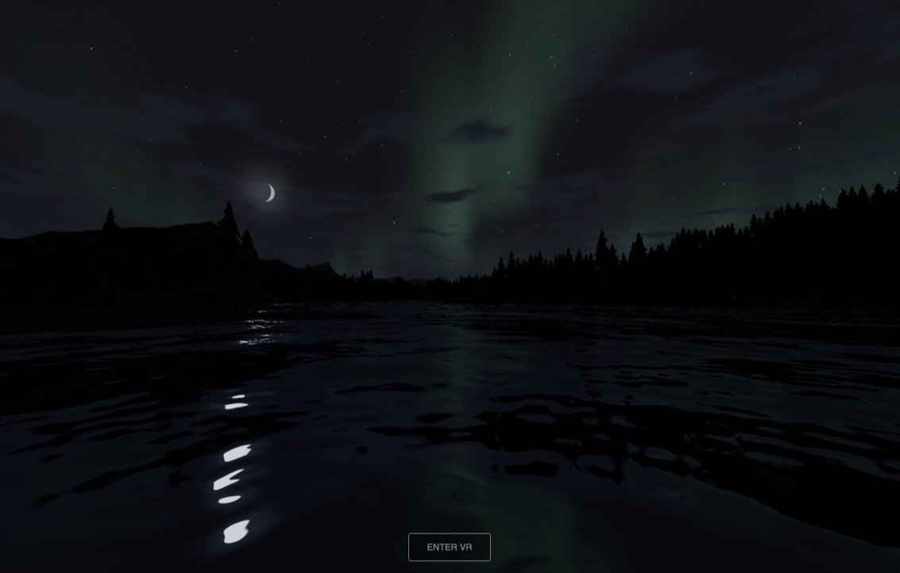
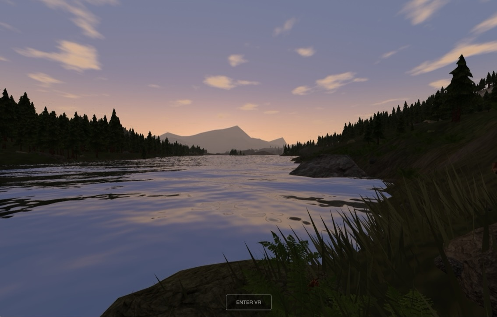
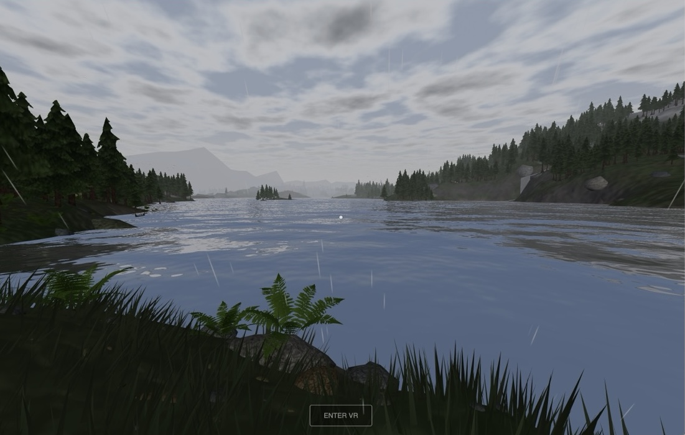

# Aurora







A WebXR snowy mountainscape for the Meta Quest 2. The world is procedurally generated, N64-era low-poly with baked lighting, and meant to be explored on foot at walking pace while the Northern Lights play overhead at night. It also runs in a desktop browser, and that is where most of the development happens.

The world is a roughly 16 km island of mountains, lakes, rivers and forest, with roads linking Nordic-named towns, stone bridges, caves, weather, a day/night cycle, fire, wildlife, villagers, health and sleep, and a small WebSocket relay so a few people can share a world and see each other's avatars and hands. There is no server-side game state: everything is generated at boot from a seed.

## Vision and constraints

The project is held together by four constraints, which decide arguments (full text in [`DESIGN.md`](DESIGN.md)):

1. **Quest 2 is the only target.** It is both the budget and the measurement device. Stronger hardware is a user-facing quality multiplier in `src/budget.js`, never a parallel plan.
2. **About 350k triangles per frame and 40-50 draw calls.** Ground is the backdrop, so terrain spends only a sliver of that and everything else (trees, rocks, buildings, creatures) is built with LOD ladders to fit what is left.
3. **The sim layer imports no three.js.** `src/sim/*` and `src/clock.js` run in plain Node, which is what lets `npm run check` gate them headlessly and keeps the door open to porting the sim elsewhere.
4. **Nothing counts as done until a gate script asserts it.** A gate that cannot fail is not a gate; see [`design/lessons.md`](design/lessons.md).

The stack is WebXR, three.js and WebGL2, deployed as static files. Shaders are GLSL injected through `onBeforeCompile` (WebGPU/TSL was deliberately dropped, see `design/01-platform.md`). Comfort outranks capability in locomotion: forward-only stick, snap turn, eased acceleration, comfort vignette, teleport on a button.

## Getting started

You need Node.js (the relay requires >= 22; the client has been run on current Node) and npm.

```sh
git clone <this repo>
cd aurora-game
npm install
npm run dev
```

Vite serves on port 5173 with a self-signed certificate (WebXR needs a secure context).

- **Desktop:** open `https://localhost:5173/` and accept the certificate warning. Move with WASD or the arrow keys, `T` teleports, `G` grabs, `E` drops. Space and Shift fly up and down for surveying the map; click plants a measuring beam.
- **Quest, over LAN:** open `https://<your-lan-ip>:5173/` in Quest Browser, click through "Advanced" then "Proceed", and press Enter VR.
- **Quest, over USB (no cert warning):** enable developer mode, run `adb reverse tcp:5173 tcp:5173`, and open `http://localhost:5173` on the headset.

`/` is the world, and `/?editor` is the same world with the authoring panel over it.

### Everyday commands

| Command | What it does |
| --- | --- |
| `npm run dev` | Dev server on `0.0.0.0:5173` (HTTPS, no HMR; reload the page) |
| `npm run build` | Production build into `dist/`. Run it after every code change to confirm nothing broke |
| `npm run preview` | Serve the built `dist/` |
| `npm run check` | The full gate suite, roughly 75 headless Node scripts in `scripts/check-*.mjs` |
| `npm run check-<name>` | A single gate, for the ones with a shortcut (`check-net`, `check-weather`, `check-towns`, `check-roads`, ...); otherwise `node scripts/check-<name>.mjs` |
| `npm run relay` | Start the multiplayer relay on port 3004 (`cd server && npm install` first) |

A few gates (terrain, sim, village) assert wall-clock timings and can flake on a loaded machine. Re-run a red one alone before assuming a regression.

### Trying multiplayer locally

```sh
cd server && npm install && cd ..
npm run relay
VITE_WS_URL=ws://localhost:3004/ws npm run dev
```

For a headset, add `adb reverse tcp:3004 tcp:3004` next to the 5173 one. The relay carries pose, hand presence and avatar id only, and keeps nothing.

## Where things live

| Path | What is there |
| --- | --- |
| `src/v2/` | The current world: terrain, rooms (overworld, glens, caves, town interiors), boats, hands, vitals, audio, UI, networking |
| `src/sim/`, `src/clock.js` | Three.js-free simulation, run by the gate scripts in Node |
| `src/budget.js` | The triangle and draw-call budget, and the quality multiplier |
| `scripts/` | The `check-*` gates, bakes, probes and `trace-report.mjs` |
| `tools/` | Offline asset pipelines: props (Blender), trees, creatures, fauna, characters, buildings, music |
| `server/` | The WebSocket relay |
| `devops/` | VPS deploy scripts (Caddy, systemd, rsync); see [`devops/README.md`](devops/README.md) |
| `design/` | The design docs, one numbered file per subject |
| `public/` | Shipped assets (about 34 MB) |
| `tmp/` | Gitignored scratch space for probes and source assets |

### Bench pages

Every `.html` file at the repo root other than `index.html` is a bench: a page that judges one thing the world can't show well on its own, such as twenty seeds of a tree side by side or a shader on an empty sky. Drop a file in and it is live at `/<name>` with no config. Examples: `/gen-tree-v9`, `/gen-rock`, `/gen-building`, `/gen-grass`, `/props`, `/map`, `/test-aurora`. The catalogue is in `design/17-workflow.md`.

Several generator benches call paid services through dev-server endpoints, and need keys in a gitignored `.env` at the repo root:

```sh
OPENROUTER_API_KEY=...   # image generation (character sheets, creature and prop candidates)
TRIPO_API_KEY=...        # image-to-3D (creatures, tree v9, props)
```

The world itself needs neither key. These benches spend real money per click, and they do not work from a static build.

### Optional tooling

- **Blender** for `npm run props` and `npm run props:layers`. It is found on `PATH`, or at `/Applications/Blender.app/Contents/MacOS/Blender`, or via the `BLENDER` environment variable.
- **A VPS** for deployment: copy `devops/deploy.env.example` to `devops/deploy.env`, fill it in, then `./devops/host-setup.sh` (once per host), `./devops/provision.sh` (once per app) and `./devops/deploy.sh`.

## Working with Claude Code

This repo is set up for it. The quickest way to get oriented is to run `claude` in the repo root and ask it to orient itself: [`AGENTS.md`](AGENTS.md) holds the working rules, [`DESIGN.md`](DESIGN.md) is an index into `design/`, and the agent will load only the sections a task needs. Ask it something like "how does rock LOD work?" or "add a gate for X" and it will find the right doc, the code and the check that covers it.

## Reading the design docs

Start with [`DESIGN.md`](DESIGN.md). It is an index: the table maps section numbers to files, and source comments cite `DESIGN.md §N`, where `§N` resolves to `design/NN-*.md`. Load the one or two files you need rather than the folder. Then read [`design/lessons.md`](design/lessons.md), which lists the failure modes this project keeps re-learning, and [`design/17-workflow.md`](design/17-workflow.md) for the desktop-first, headset-gated workflow. Work that was built, measured and reverted lives in `design/history/` and is not in the tree.

Docs hold current truth: when a fact changes, rewrite the sentence that is wrong rather than appending a note. Prose uses `--` rather than em dashes and does not hard-wrap paragraphs. Comments in code state what is true now; chronology and rejected approaches belong in `design/`.

## License

No license has been chosen yet.
